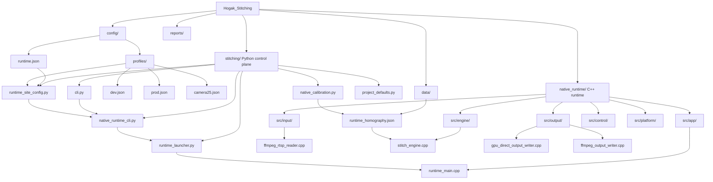
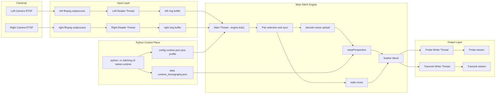
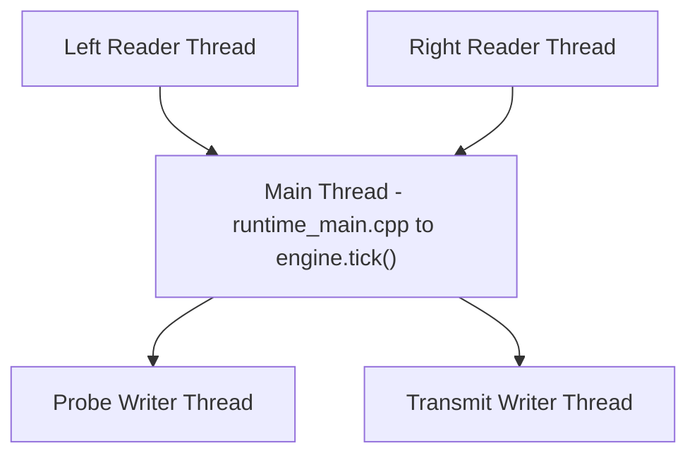
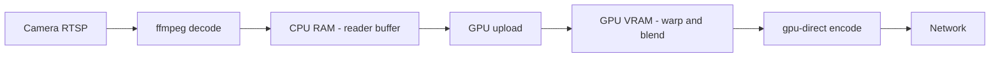

# Runtime Architecture Diagrams

이 문서는 현재 프로젝트의 실행 구조를 Mermaid.js로 빠르게 파악하기 위한 도식 모음이다.
설명은 현재 `native-runtime` 기준이며, 상세 배경은 [01_project_overview_and_architecture.md](/c:/Users/Pixellot/Hogak_Stitching/reports/01_project_overview_and_architecture.md)와 [07_new_hire_handoff_study_guide.md](/c:/Users/Pixellot/Hogak_Stitching/reports/07_new_hire_handoff_study_guide.md)를 보면 된다.

## 1. Repository Structure

핵심만 보면:

- `stitching/`은 설정, 실행, calibration, 모니터링을 맡는다.
- `native_runtime/`은 실제 실시간 입력 처리, stitch, encode, transmit를 맡는다.
- `config/`는 현장 설정과 운영 profile을 가진다.
- `data/`는 runtime이 쓰는 고정 데이터, 현재는 주로 homography를 가진다.

## 2. Runtime Flow

이 그림의 의미:

- 카메라 영상은 RTSP로 들어오고, 입력층에서 먼저 ffmpeg subprocess가 디코드한다.
- 각 reader thread가 raw frame을 읽어 ring buffer에 적재한다.
- 메인 thread의 `engine.tick()`가 버퍼를 읽고 pair를 고르고 stitch를 수행한다.
- stitch 결과는 `probe`와 `transmit` writer thread로 넘어간다.

## 3. Thread Model

현재 구조를 짧게 설명하면:

- 입력 RTSP 수신은 reader thread가 백그라운드에서 처리한다.
- 메인 stitch 엔진은 별도 worker thread가 아니라 main thread에서 `tick()`으로 돈다.
- 출력 encode/write는 writer thread가 백그라운드에서 처리한다.

실행 옵션에 따라 실제 활성 스레드는 달라진다.
예를 들어 `--no-viewer`에 `transmit=gpu-direct`만 켜면 보통 메인 1개 + reader 2개 + writer 1개 구조가 된다.

## 4. Data Path

```mermaid
flowchart LR
    A["RTSP stream - H.264 or H.265"] --> B["ffmpeg decode"]
    B --> C["rawvideo input - usually nv12"]
    C --> D["reader buffer - frame seq timestamp"]
    D --> E["pair and sync selection"]
    E --> F["GPU upload and prepare"]
    F --> G["warpPerspective"]
    G --> H["feather blend"]
    H --> I["stitched frame"]
    I --> J["gpu-direct or ffmpeg writer"]
    J --> K["H.264 encode"]
    K --> L["UDP or TCP output"]
```

이 경로에서 중요한 점:

- RTSP는 전송 프로토콜이고, 실제 압축 비디오는 보통 H.264/H.265다.
- 입력 raw 포맷은 기본적으로 `nv12`를 많이 쓴다.
- pair/sync는 단순히 최신 프레임을 붙이는 것이 아니라, 현재 cadence와 freshness를 고려해 좌/우 한 쌍을 고른다.
- output은 `gpu-direct` 또는 `ffmpeg` writer가 담당한다.

## 5. CPU RAM / GPU VRAM View

현재 baseline에서 좋은 경로는 위와 같다.
다만 실제로는 overlay, fallback, debug path에 따라 `GPU -> CPU download`가 추가될 수 있다.

즉 이 프로젝트는 완전한 end-to-end GPU-only 구조는 아니고:

- 입력은 아직 CPU 경계를 거치고
- stitch와 encode는 가능한 한 GPU 쪽으로 붙이는 구조

라고 이해하면 된다.

## 6. Reading Order

이 구조도를 본 뒤 실제 코드를 읽을 때는 아래 순서가 좋다.

1. [README.md](/c:/Users/Pixellot/Hogak_Stitching/README.md)
2. [cli.py](/c:/Users/Pixellot/Hogak_Stitching/stitching/cli.py)
3. [runtime_site_config.py](/c:/Users/Pixellot/Hogak_Stitching/stitching/runtime_site_config.py)
4. [native_runtime_cli.py](/c:/Users/Pixellot/Hogak_Stitching/stitching/native_runtime_cli.py)
5. [runtime_main.cpp](/c:/Users/Pixellot/Hogak_Stitching/native_runtime/src/app/runtime_main.cpp)
6. [ffmpeg_rtsp_reader.cpp](/c:/Users/Pixellot/Hogak_Stitching/native_runtime/src/input/ffmpeg_rtsp_reader.cpp)
7. [stitch_engine.cpp](/c:/Users/Pixellot/Hogak_Stitching/native_runtime/src/engine/stitch_engine.cpp)
8. [gpu_direct_output_writer.cpp](/c:/Users/Pixellot/Hogak_Stitching/native_runtime/src/output/gpu_direct_output_writer.cpp)
